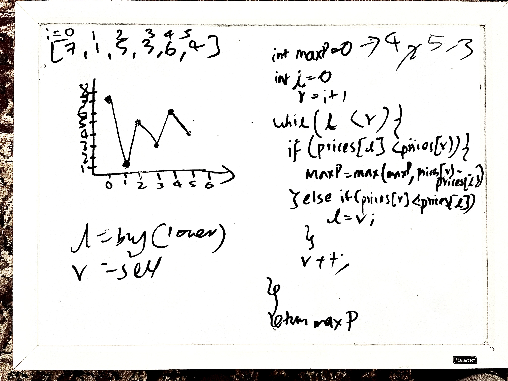

```Java
class Solution {
    public int maxProfit(int[] prices) {
        //creating the max as the maximum profit possible (it is the return varaible)
        //we are going to be using the two pointer method 
        //  l to be the buying pointer and r to be the selling pointer
        int max = 0, l = 0, r = l+1;

        //iterating through the prices
        //till we have prices that we can sell
        while (r < prices.length){

            //if we are in a profitable position, i.e our buying cost is lower than selling cost
            if (prices[l] < prices[r]){
                //check if its the maximum profit we have so far
                max = Math.max(max, prices[r]-prices[l]);
            } else{
                //we we are not in a profitable position meaning that our selling stance is lower than our buying stance
                //we move the left pointer to the lowest position so that we can maximize our profits
                l = r;
            }
            //we have to keep finding new prices through the iteration
            r++;
        }

        //returning the computed max profit
        return max;
    }
}
```

